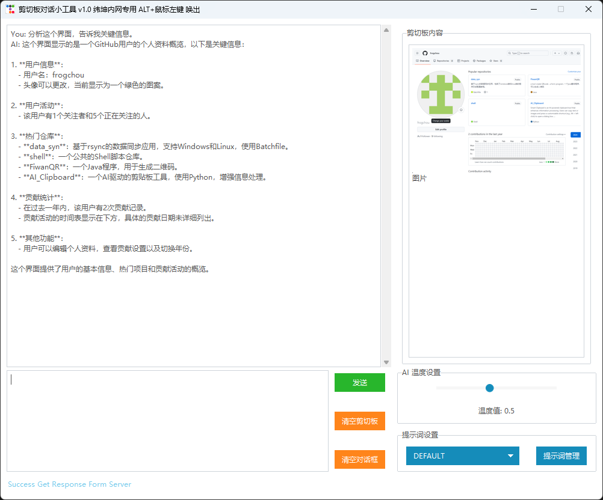

# AI_Clipboard
Smart Clipboard is an AI-powered clipboard tool that enhances information processing. Users can copy text or images and press a customizable shortcut (e.g., Alt + left click) to open a dialog box. It displays the copied content and features a chat window for AI inquiries. Custom prompts allow for personalized responses.

# 项目介绍
是一款创新的剪切板AI工具，旨在提升用户在信息处理和知识获取方面的效率。该工具常驻于用户的操作系统中，提供便捷的访问和智能助手功能。
用户只需简单地复制所需的文字或图片，随后按下自定义的快捷键（如 Alt + 鼠标左键），即可弹出一个直观的对话框。在对话框的左侧，用户复制的信息将被清晰展示；右侧则是一个交互式的聊天窗口，用户可以在此向AI提问，获取详细的解释、建议或相关信息。
Smart Clipboard 还支持用户自定义提示词，允许用户添加特定的提示，以便在咨询AI时提供更具针对性的上下文，从而获得更加精准和个性化的回答。
无论是学术研究、工作协作还是日常生活，Smart Clipboard 都是您不可或缺的智能助手，帮助您快速获取所需信息，提升工作效率。通过简洁的界面和强大的功能，Smart Clipboard 让信息处理变得轻松而高效。

# 程序截图

# 功能介绍
    1、复制文字或图片后，按下快捷键Alt+鼠标左键，即可唤出对话框
    2、对话框左侧展示复制的内容
    3、对话框右侧为聊天窗口，用户可以在此向AI提问，获取详细的解释、建议或相关信息
    4、用户可以自定义提示词，以便在咨询AI时提供更具针对性的上下文，从而获得更加精准和个性化的回答
    5、用户可以查看聊天记录
    6、用户可以清空聊天记录
    7、用户可以设置AI的回答温度
    8、用户可以自定义提示词

# TODO List
    1、优化聊天记录的展示
    2、优化提示词的展示
    3、增加自定义快捷键设置
    
